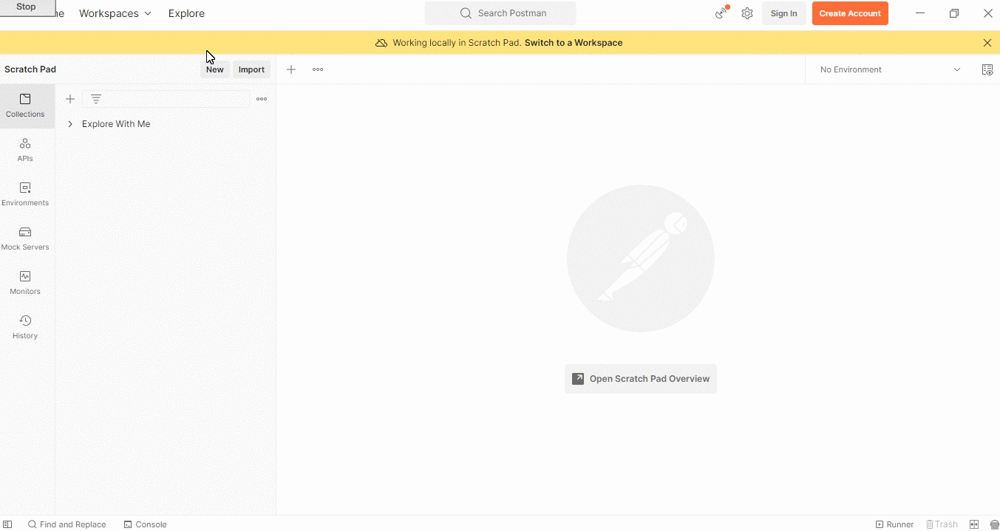

# Explore with me 
#### (англ. "Исследуй со мной") 
### Приложение для организации событий и участия в них. 
###### Приложение разработано в рамках прохождения учебного курса [Java-разработчик от Яндекс.Практикум](https://practicum.yandex.ru/java-developer/)
***
Свободное время — ценный ресурс. Ежедневно мы планируем, 
как его потратить — куда и с кем сходить. Сложнее всего в 
таком планировании поиск информации и переговоры. Какие намечаются 
мероприятия, свободны ли в этот момент друзья, как всех пригласить 
и где собраться. Это приложение — афиша, 
где можно предложить какое-либо событие от выставки до похода в кино 
и набрать компанию для участия в нём.
Ниже представлен пример веб-интерфейса приложения.
 

## Основа приложения 

Приложение состоит из двух сервисов, каждый имеет свою базу данных.
Основной сервис — содержит всё необходимое для работы продукта.
Сервис статистики — хранит количество просмотров и позволяет делать различные выборки для 
анализа работы приложения. 
  _Предполагается, что Explore with me работает со сторонним сервисом 
авторизации и аутентификации, который частично обрабатывает первоначальные запросы и дальше 
передает их в основной сервис Explore with me._

## Функционал

**Основной сервис** включает в себя функции для использования администраторами, авторизованными 
пользователями и незарегистрированными пользователями("случайными прохожими").
  *__Администраторы могут__*:
 - управлять категориями для событий - добавлять, измененять и удалять категории.
 - управлять подборками мероприятий - добавлять, удалять и закреплять на главной странице.
 - модерировать события, размещённые пользователями, — публикация или отклонение.
 - управлять пользователями — добавлять, просматривать и удалять.
 - получать подробную информацию об всех лайках/дизлайках указанного события.
  **_Авторизованные пользователи могут_**:
 - добавлять в приложение новые мероприятия, редактировать их и просматривать после добавления.
 - подавать заявки на участие в интересующих мероприятиях.
 - подтверждать заявки, которые отправили другие пользователи сервиса (доступно только для 
организаторов событий).
 - ставить лайки/дизлайки событиям (только тем, в которых участвовали).
 - получать краткую информацию обо всех лайках/дизлайках своего события.
  **_Незарегистрированные пользователи("случайные прохожие") могут_**:
 - просматривать список событий с краткой информацией по ним, в соответствии с выбранной 
сортировкой(по количеству просмотров событий, по дате событий или по рейтингу событий).
 - просматривать подробную информацию о выбранном событии.
 - просматривать все имеющиеся категории событий.
 - просматривать подборки событий, составленные администратором.

Второй сервис, **статистики**, призван собирать информацию. 
  _Во-первых_, о количестве обращений 
пользователей к спискам событий.
  _Во-вторых_, о количестве запросов к подробной информации 
о событии. 
  На основе этой информации формируется статистика о работе приложения.

## Спецификация

Спецификацию для сервисов можно посмотреть с помощью сайта [Swagger](https://editor-next.swagger.io/), 
импортировав туда [файл](ewm-main-service-spec.json) для основного сервиса 
и [файл](ewm-stats-service-spec.json) для сервиса статистики.
 

## Стек технологий

 - *[Windows](https://www.microsoft.com/ru-ru/software-download/windows10) 10* - операционная 
система
 - *[Java](https://www.java.com/ru/) 11* - язык программирования
 - *[IntelliJ IDEA](https://www.jetbrains.com/ru-ru/idea/download/?ysclid=l8l4s0cdro888284513#section=windows) 2022.1.4 (Ultimate Edition)* - среда разработки
 - *[Spring Boot](https://spring.io/blog/2022/07/21/spring-boot-2-7-2-available-now) 2.7.2* - используемый фреймворк 
 - *[Apache Maven](https://maven.apache.org/) 4.0.0* - управление зависимостями
 - *[Project Lombok](https://projectlombok.org/) 1.18.24* - библиотека аннотаций для сокращения 
шаблонного кода
 - *[Hibernate](https://hibernate.org/) 5.6.10* - ORM-фреймворк
 - *[PostgreSQL](https://www.postgresql.org/) 11-alpine* - база данных
 - *[Docker Desktop](https://docs.docker.com/desktop/install/windows-install/) 20.10.17* - платформа контейнеризации
 - *[Docker Compose](https://docs.docker.com/compose/install/) 3.1* - утилита для развертывания нескольких контейнеров
 - *[Postman](https://www.postman.com/downloads/) 9.31.0* - приложение для выполнения запросов к API.

## Шаблоны проектирования

  В приложении использован шаблон проектирования Data Transfer Object (DTO Pattern).

## Запуск приложения

На Вашем компьютере должны быть установлены соответствующие приложения из раздела ["Стек 
технологий"](#стек-технологий).
Для запуска приложения необходимо:
- склонировать [проект](https://github.com/gorden73/java-explore-with-me) на свой компьютер 
- запустить приложение _Docker_
- открыть склонированный проект в _IntelliJ IDEA_
- открыть терминал командной строки и вписать команду `mvn clean package`. Дождаться выполнения 
  успешной сборки проекта.
- далее в терминал вписать команду `docker compose up` и дождаться успешного запуска основного 
  сервиса и сервиса статистики в контейнерах _Docker_.
- готово, можно использовать приложение согласно спецификации(см. раздел 
["Спецификация"](#Спецификация)).

## Выполнение тестов

На данном этапе тестирование возможно с помощью коллекции тестов и приложения 
Postman, способного выполнять запросы к API. Для запуска коллекции тестов необходимо предварительно 
выполнить все инструкции из раздела ["Запуск приложения"](#запуск-приложения), далее запустить 
приложение приложение [Postman](https://www.postman.com/downloads/), импортировать 
[коллекции тестов](/postman/sprint.json), нажать на вкладку *"Run collection"*.
Готово. Тесты пройдут автоматически.
 

## Автор

Связаться с автором проекта можно в [telegram](https://web.telegram.org/) (@gorden73).

[Вернуться в начало](#explore-with-me)
